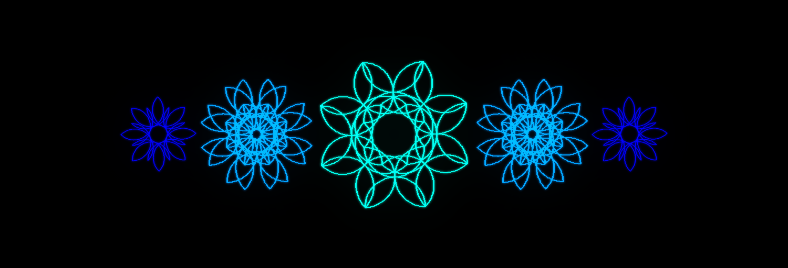
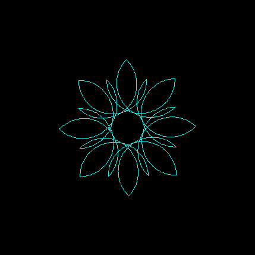

# Leona
## *What is this?*
This is a implementation of a language for drawing pictures. This was originally a project that was an assignment of the course DD1360 at the Royal Institute of Technology (KTH). The assignment only included making text output but I made it support graphical output as well.

## *How do I use it?*
Compile the code or download the executable from the releases page. You can run the executable directly by it self and it will prompt you for a file path to a file containing the code. You can also (which i recommend) open a file with the program, and it will automatically use that file as code input. In windows this can be done by dragging and dropping the file onto the executable.

## *What is the syntax?*
    down.            % will put the pen down which will start the drawing
    forw 100.        % will move the cursor forward 100 pixels
    back 100.        % will move the cursor backwards 100 pixels
    left 90.         % will turn the cursor 90 degrees to the left
    right 90.        % will turn the cursor 90 degrees to the right
    up.              % will put the pen up which will stop the drawing
    color #FF0000.   % will set the color to #FF0000 which is red
    rep 4 forw 10.   % will repeat the forw 10 command 4 times
    
    % rep can either with just one command, or with a block of commands
    % the block is started and ended with " like this:
    rep 4 "forw 10. left 90."

All commands except rep have to be ended with a period. All commands are case insensitive.    

## *Show me an example please*
Sure, here is a code example:

    % will set the color and then draw a "flower"

    down.
    color #00fff2.
    rep 8 "left 45. rep 2 "rep 90 "forw 2. left 2." left 90.""

Output:

## *How is the language implemented?*
There are two parts to the implementation.

Lexer

The lexer converts an input string to a list of tokens.  

In my implementation a token is an abstract class that is extended by all the different types of tokens. Look at the Token class and the different subclasses for more information. They are located in the Models folder.
 

Parser

The parser converts a list of tokens into a parse tree (also known as a syntax tree). A parse tree is just a fancy word for a list of instructions that can be thought to be in the shape of a tree since a instruction (specifically the repeat instruction) can have a sub list of instructions.  

In my implementation there is a class called ParseTree that represents a (you guessed it) parse tree. A ParseTree contains a list of instruction objects are created by the parser from the tokens.
 

#### *How are the files structured?*
The files are divided into different namespaces. Each namespace has a folder with the same name. Basically there are two large categories of folders. Models and Helpers. Models contains all the classes that are models. A model is a type of class that is primarily used to represent some kind of information. Helpers contains all the classes that are helpers. A helper is a type of class that is primarily used to help with some kind of task.

The line between a model and a helper is not always very clear since everything is just objects at the end of the day. But I think that the distinction is still useful. For example, a Token is a model since it is used to represent some kind of information, it's primary use is to hold information. A Tokenizer is a helper since it is used to help with some kind of task, it's primary use is to do something.

#### *Are there tests?*
I'm glad you asked, yes there are loads of tests. Tere is a separate test project that will test the main project (both are in the same solution). You can run them by opening the solution in Visual Studio and then right clicking on the test project and selecting "Run Tests".

## *What language is this written in?*
This is written in C#. If you are familiar with Java, then I have great news for you. C# is like Java but without all the bad parts.

C# is cross platform and can be compiled to run on basically any platform. It is in a way very similar to Java but with a more thought through design that is consistent throughout. C# is generally considered faster than Java and has some pretty sweet features that Java developers unfortunately miss out on. LINQ (Language Integrated Query) and more powerful reflection are two examples.

I guess it's time for me to stop trying to brainwash you to switch to C#, but really, you should give it a try. Did you know stack overflow is written in C#? Now you do. Did you also know that 64% of people that use C# answered that they loved it but only 46% of Java developers answered that they loved Java? Well wow, now you know.

Anyway, I'm not here to tell you what to do, I'm just here to tell you that this project is written in C#. If you want to learn more about C# then I recommend you check out the [official documentation](https://docs.microsoft.com/en-us/dotnet/csharp/).

## *What is the license?*
This project is licensed under the MIT license. See the LICENSE file for more information.

This basically means that you can do whatever you want with this code, I don't care. But please remember that if you happen to have an assignment or anything like that that happens to be very similar to the one this code solves then you should not copy it. I firmly believe that information and knowledge is made to be spread and not hidden away. But I also believe that you should not cheat on your assignments.

When I die I want to leave a legacy behind me. I want to be remembered as the guy that made the best implementation of a language for drawing pictures. I want to be remembered as the guy that made the best implementation of a language for drawing pictures that was also open source. I want to be remembered as the guy that made the best implementation of a language for drawing pictures that was also open source and had a readme file that was written in markdown with parts that were written by github copilot.

No but really, I want to make the world a better place and I believe in spreding information and knowledge and helping people learn. But I also believe that you should not cheat on your assignments. So please don't cheat on your assignments, use this code to learn and to get inspiration but don't copy it.

I'm not responsible for what anyone does with this code.